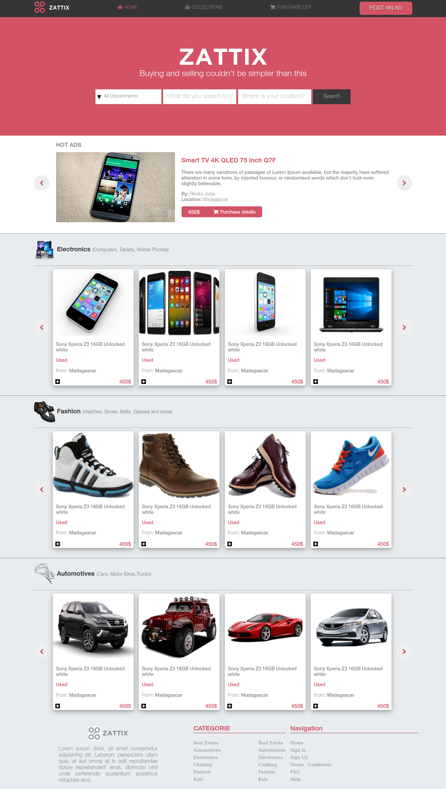
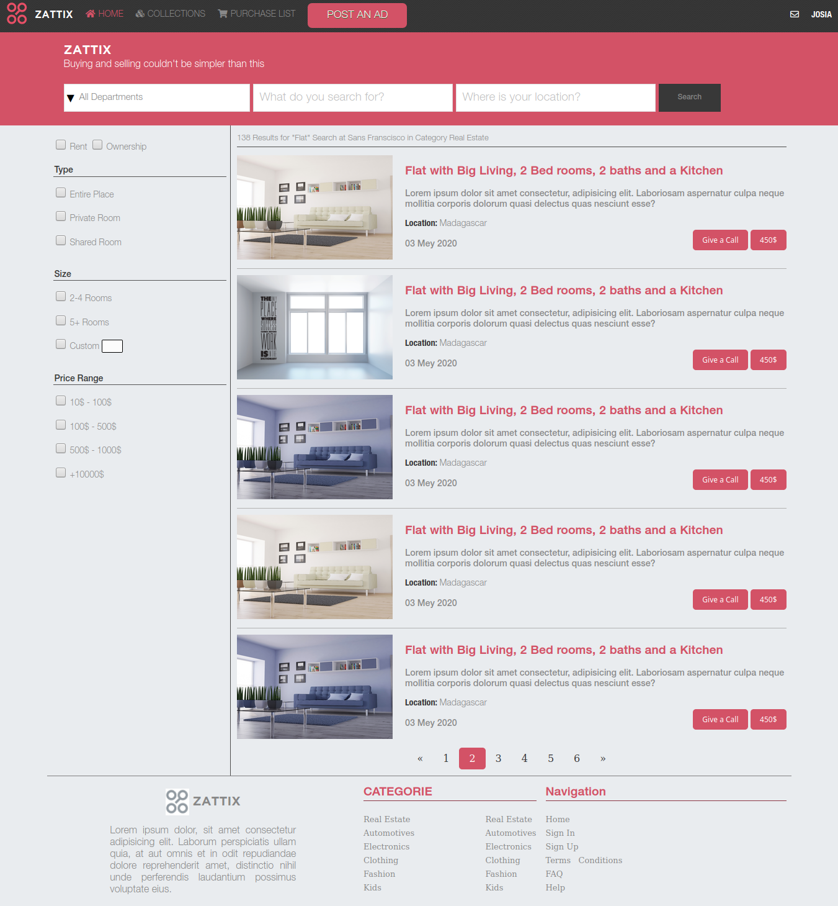

# Capstone-html: Online Shop for Electronics
HTML &amp; CSS capstone project: Online shop for electronics

# Description
  * In this project I built a Responsive Web-page design with HTML and CSS.
  * The website is structured according to this layout, designed by **[Mohammed Awad](https://www.behance.net/gallery/24796463/ZATTIX)**
  * It's a 2-pages website, which includes the main page and the search result page.
  * The web-page is responsive in 2 different screen sizes:
    1. Mobile version : up to 768px;
    2. Tablet & desktop: from 768px;

# Built With
* Plugin Jquery "Shadowbox"
* HTML
* CSS

# Live Demo
**[Live Demo](https://rawcdn.githack.com/rindrajosia/capstone-html/31db66316b628f3e88ffdb63ef0798613c6382d9/index.html)**

# Getting Started
To use it locally, you need to :
1. Fork the repository to your GitHub account.
2. Choose a local folder for the cloned files.
3. Clone the repository to your local machine.
4. Double click on 'index.html'.

# Authors

**Rindra Josia**

* Github: **[@rindrajosia](https://github.com/rindrajosia)**
* Twitter: **[@rindrajosia](https://twitter.com/josia_rindra)**
* Linkedin: **[linkedin](https://www.linkedin.com/in/rindra-josia-99b2111a2/)**

#  Contributing

Contributions, issues and feature requests are welcome!
Feel free to check the **[issues](https://github.com/rindrajosia/capstone-html/issues)** page.

#  Show your support

  Give ⭐️ if you like this project!

# Acknowledgments

* Shadowbox Js
* Microverse
* Contributors
